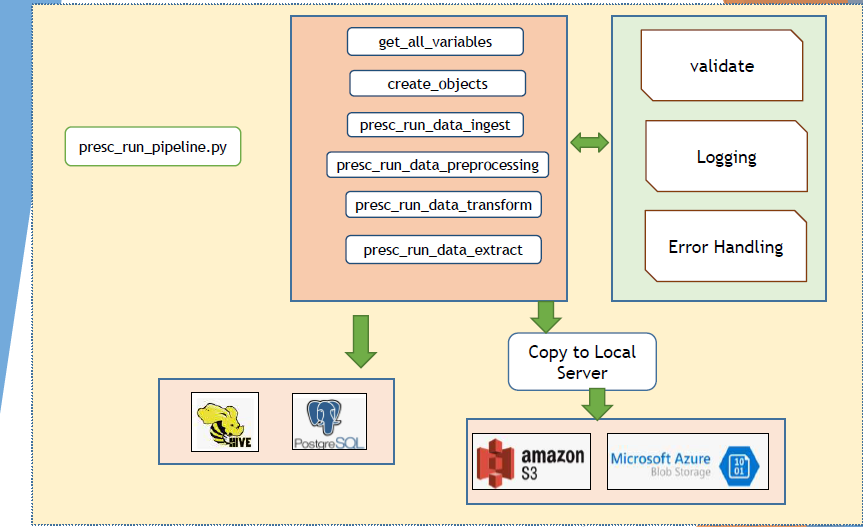

# Spark_US_HealthCare_Project | Modern Data Engineering SPARK Project

## Introduction
The goal of this project was to perform ETL[Extract, Transform and Load] on US City and US City Presciber Data using spark and python, load data into Amazon S3 and AzurecBlob storage and finally persist the data from dataframes into Hive table and PostgresSQL Tables.

## Archtecture

## Technology Used
- Programming Language - Python
- Big Data - PySpark

Data WareHousing Solution
1. Hive

RDBMS
1. PostgresSQL

Cloud Services Used

Amazon Web Services
1. S3 Storage
   
Microsoft Azure
1. Azure Blob Storage

## Dataset Used
US City Dimension and US City Prescriber Data

Link to the Dataset Used: s3://prescpipelineanalytics/Input_Data/
